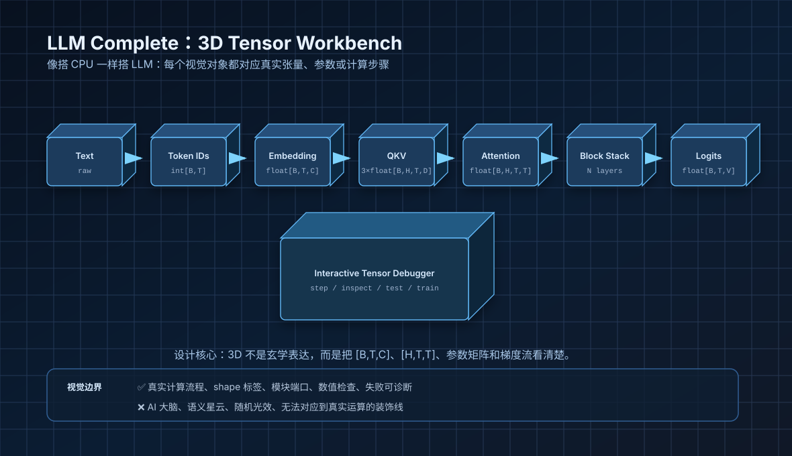
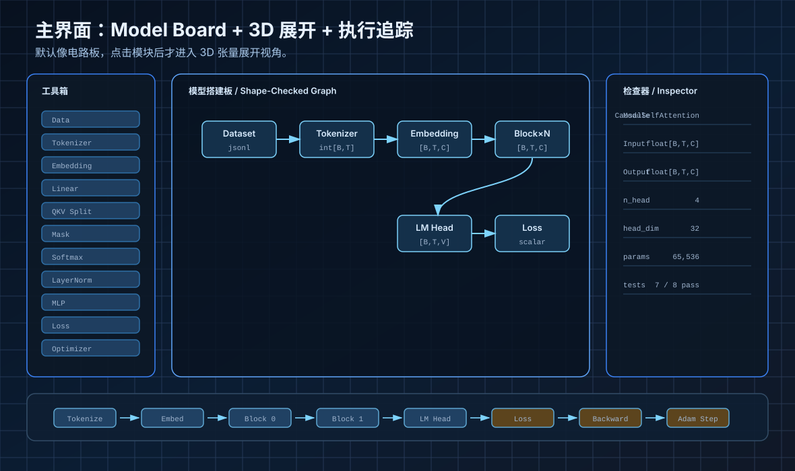
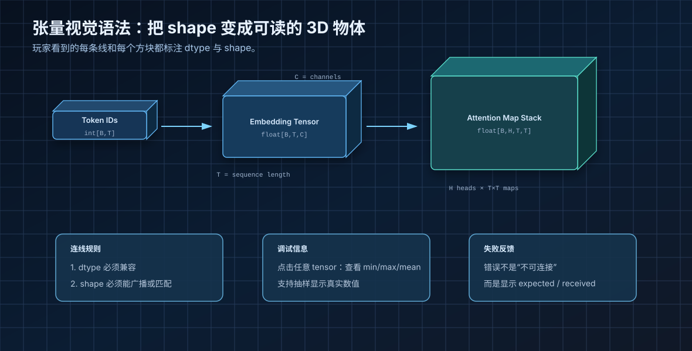
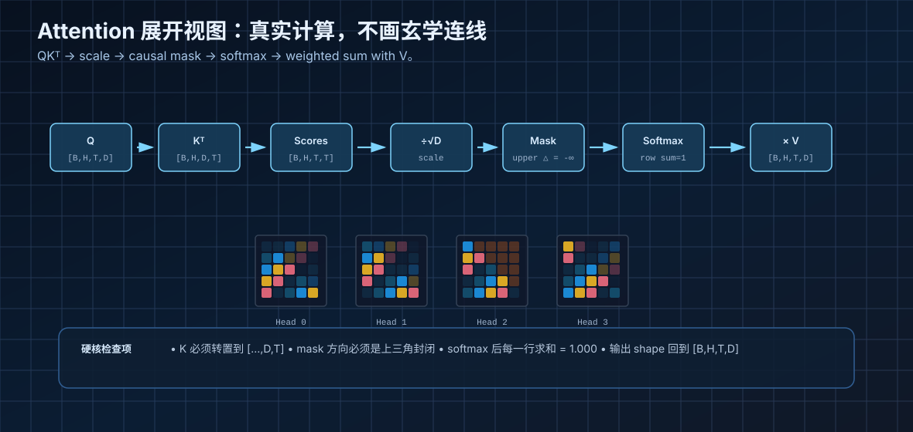
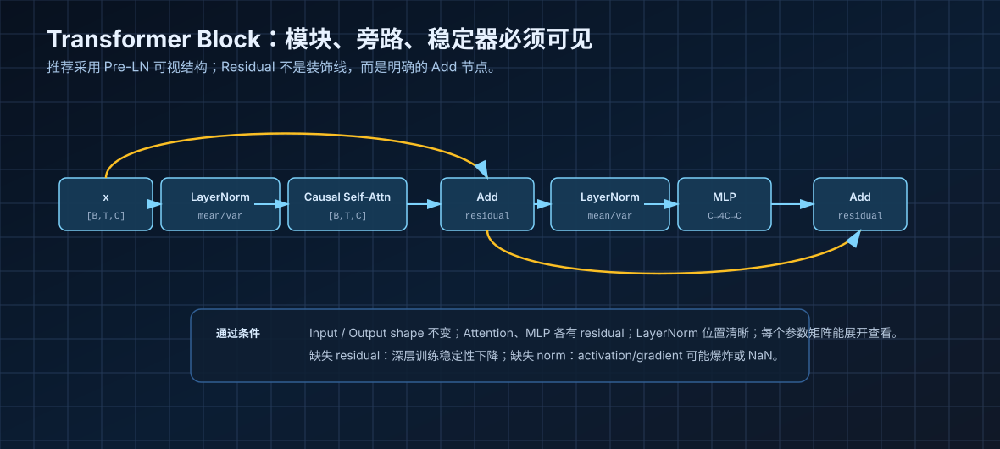
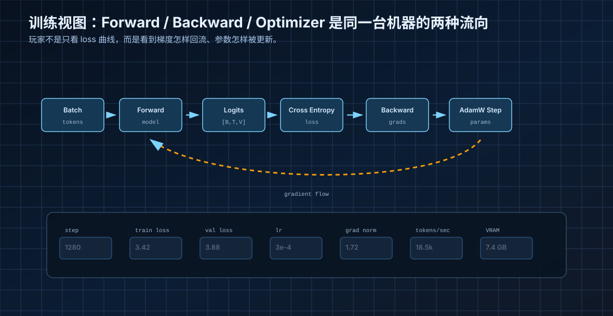
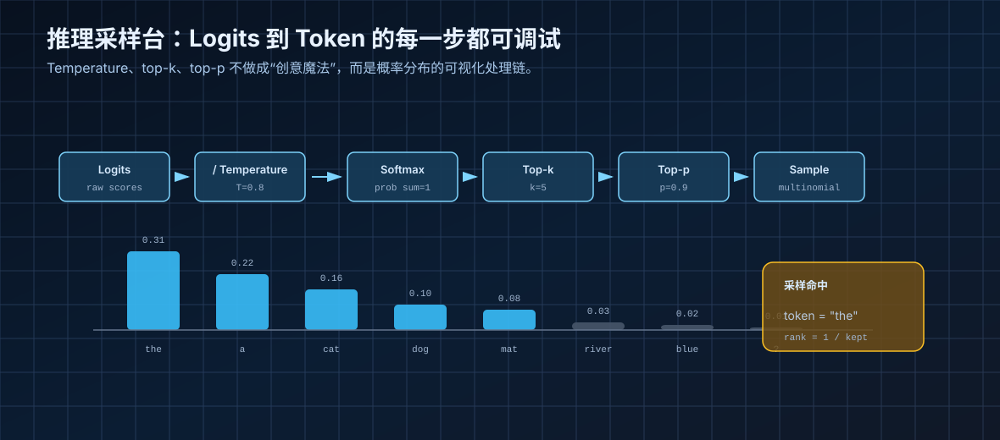
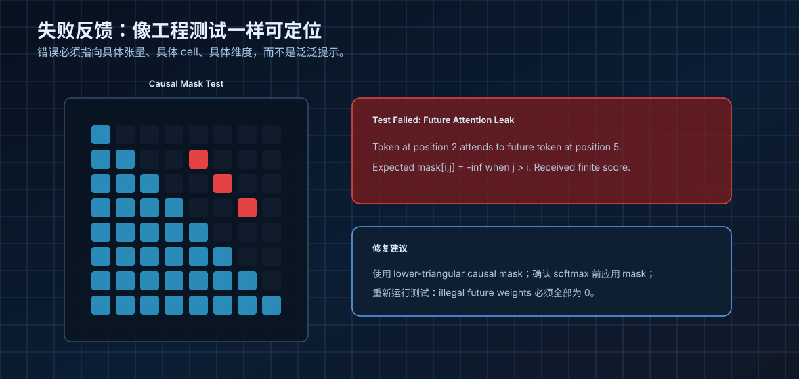
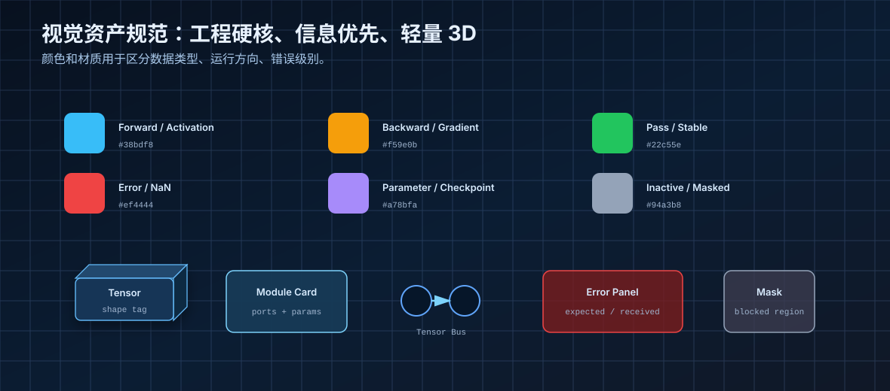

# LLM Complete：3D Tensor Workbench 视觉设计文档

> 版本：v0.1  
> 方向：硬核真实感 / 3D 张量机器 / 图灵完备式学习路径  
> 用途：游戏概念设计、UI/UX 原型、美术风格探索、Vertical Slice 制作说明  
> 核心句：**像搭 CPU 一样搭 LLM。3D 只负责把真实计算过程看清楚，不负责把 AI 神秘化。**

<style>
  .fig { margin: 20px 0 28px 0; }
  .fig img { width: 100%; max-width: 1180px; border-radius: 12px; box-shadow: 0 10px 28px rgba(0,0,0,.18); }
  .fig figcaption { font-size: 13px; color: #6b7280; margin-top: 8px; line-height: 1.55; }
  .note { padding: 12px 14px; background: #f7fafc; border-left: 4px solid #2b6cb0; border-radius: 6px; }
  .warn { padding: 12px 14px; background: #fff8f1; border-left: 4px solid #dd6b20; border-radius: 6px; }
  .grid2 { display: grid; grid-template-columns: 1fr 1fr; gap: 12px; }
  .tag { display:inline-block; padding:2px 8px; border-radius:12px; background:#eef2ff; color:#3730a3; font-size:12px; }
</style>

<figure class="fig">

<figcaption>图 1：主视觉定位。保留 3D 空间感，但所有对象都对应真实 LLM 训练/推理流程。</figcaption>
</figure>

---

## 0. 一页摘要

本项目不是“AI 科普动画”，而是一款偏硬核真实感的 LLM 构建与训练游戏。玩家通过拖拽、连接、单步执行、测试和调试，从最小概念开始搭出一个 decoder-only Transformer，并逐步扩展到训练循环、采样、评测、SFT 与偏好对齐。

视觉上采用 **3D Tensor Workbench / 三维张量工作台**。默认界面接近《图灵完备》式电路工作台：模块有端口，连线有类型，输入输出有 shape，错误有测试反馈。3D 表现只在能提高理解效率时使用，例如把 `[B,T,C]` 做成长方体、把 `[H,T,T]` 做成多头 attention 热力图堆栈、把参数矩阵做成可展开的内存板。

### 设计目标

| 目标 | 说明 |
|---|---|
| 真实 | 每个模块对应真实 LLM 计算对象，例如 Tokenizer、Embedding Table、QKV Linear、Causal Mask、Softmax、LayerNorm、MLP、LM Head、Loss、Optimizer。 |
| 可验证 | 每关都有输入输出测试、shape 检查、数值容差、训练指标，而不是只看动画。 |
| 可调试 | 玩家可以单步执行、查看中间张量、定位错误 cell、查看梯度和参数更新。 |
| 可成长 | 像从 NAND 门到 CPU 一样，从 token 到 tiny GPT，再到训练和对齐。 |
| 视觉清晰 | 工程硬核 UI + 轻量 3D，不使用“AI 大脑”“意识星云”等不对应真实运算的表现。 |

### 视觉关键词

**工程网格、张量方块、矩阵板、端口连线、shape 标签、数值面板、热力图、逻辑分析仪、GPU profiler、单步执行、错误高亮、参数内存、训练仪表盘、半透明 3D 计算模块。**

### 明确不要

- 不要把 Attention 画成无意义的发光神经网。
- 不要把 Embedding 表现成玄学“语义宇宙”。
- 不要把训练画成“给模型灌知识”的动画。
- 不要只给玩家看 loss 曲线而不展示 forward/backward/optimizer 的关系。
- 不要只有概念解释，没有可运行测试。

---

## 1. 参考依据与定位

### 1.1 《图灵完备》的启发

《图灵完备》的设计价值不在于画面复杂，而在于它让玩家从基础逻辑门一路构建组件、架构和汇编层级。官方介绍中提到从 NAND gate 创建其他逻辑门，再引入 memory 与更复杂组件，最终组装真实计算机架构与汇编指令。这种“底层真实 + 关卡渐进 + 玩家自己搭出来”的方法，是本项目最重要的结构参考。

本项目的等价路径不是：

```text
NAND → Logic Gates → Components → CPU → Assembly
```

而是：

```text
Text → Token IDs → Embeddings → Linear / MatMul → Attention → Transformer Block → Tiny GPT → Training Loop → Sampling → SFT / Alignment
```

设计上要继承《图灵完备》的三个特征：

1. **小零件真实**：每个零件有真实输入输出规则。
2. **组合真实**：复杂系统是由小零件组合出来的，而不是直接给一个黑盒。
3. **调试真实**：玩家通过测试和错误反馈理解原理。

### 1.2 `train-llm-from-scratch` 的教学结构

`train-llm-from-scratch` 的文档把学习顺序拆成 Foundations 与完整 pipeline。其 Foundations 部分包含 Tokenization、Decoder-only Transformer、Attention / Masks / Heads、Objectives / Losses / Perplexity、Optimization / Training Systems、Generation / Sampling；随后进入 Data、Pretraining、SFT、Reward Model、DPO、PPO、GRPO 等完整训练与后训练流程。

这正好可以映射为游戏章节：先搭核心模型，再跑训练，再进入采样、评测和后训练。视觉文档因此不围绕“大模型神秘感”，而围绕“从零构建一个可运行 tiny GPT”。

### 1.3 Transformer Explainer 的启发与边界

Transformer Explainer 证明交互式可视化适合解释 next-token prediction、embedding、Transformer block、attention、output probabilities、temperature、top-k、top-p 等概念。本项目可以学习它的“可输入文本、可观察 attention、可调 sampling 参数”的交互方式，但要更偏游戏构建与工程调试，而不是单纯可视化教程。

本项目的关键差异：

| Transformer Explainer 式 | 本项目目标 |
|---|---|
| 观察一个已有模型怎么运行 | 亲手搭建一个模型，让它通过测试 |
| 解释组件作用 | 组件必须能连接、出错、调试、修复 |
| 重点在可视化 | 重点在构建谜题 + 训练模拟 + 真实约束 |
| 适合浏览学习 | 适合关卡推进、工程挑战和反复优化 |

---

## 2. 核心视觉设定：3D Tensor Workbench

### 2.1 一句话定义

**3D Tensor Workbench 是一台可视化的 LLM 实验台：文本、token、tensor、matrix、parameter、gradient 都作为可检查的工程对象存在。**

玩家不是坐在宇宙里看 AI 思考，而是站在一台模型调试台前：

```text
Dataset → Tokenizer → Batch → Embedding → Transformer Blocks → LM Head → Loss
                                               ↑                         ↓
                                               └──── Optimizer ← Backward ┘
```

每条数据线必须说明自己传的是什么：

```text
int[B,T]
float[B,T,C]
float[B,H,T,D]
float[B,H,T,T]
float[B,T,V]
scalar loss
```

### 2.2 视觉原则

#### 原则 A：每个 3D 物体都要有真实对应物

| 可以 3D 化 | 不建议 3D 化 |
|---|---|
| tensor block | AI 心智光球 |
| attention heatmap stack | 意识星云 |
| parameter matrix board | 记忆水晶 |
| gradient flow | 灵感能量流 |
| loss / validation curves | 梦幻地形主视觉 |
| optimizer update arm | 魔法修复动画 |

#### 原则 B：主视图工程化，展开视图 3D 化

默认界面应该是 2.5D 电路板/流程图，避免玩家迷失在 3D 空间中。只有点击模块、查看张量或分析错误时，才进入 3D 展开视图。

#### 原则 C：shape 是第一视觉语言

在这个游戏里，`[B,T,C]`、`[B,H,T,T]`、`[B,T,V]` 不是程序员附注，而是玩家通关所依赖的核心图形语言。

#### 原则 D：失败反馈必须可修复

失败不是“模型坏了”，而是：

```text
Shape mismatch:
Expected: float[B,H,T,D]
Received: float[B,T,C]
```

或者：

```text
Causal mask inverted:
Token at position 3 attends to future token at position 6.
```

---

## 3. 总体 UI 架构

<figure class="fig">

<figcaption>图 2：主界面结构。默认是类似图灵完备的工作台；点击模块进入 3D 展开；底部可单步执行。</figcaption>
</figure>

### 3.1 主界面分区

| 区域 | 作用 | 视觉重点 |
|---|---|---|
| 左侧工具箱 | 放置模块，如 Data、Tokenizer、Embedding、Linear、Attention、Loss、Optimizer | 类似电路元件库，每个模块有明确图标和输入输出类型 |
| 中央模型搭建板 | 玩家拖拽和连线的主区域 | 网格背景、端口、数据线、shape 标签、测试状态 |
| 右侧检查器 | 查看选中模块的参数、shape、数值、测试结果 | 类似 IDE inspector / GPU profiler |
| 底部时间轴 | 单步执行 forward、loss、backward、optimizer | 支持暂停、回放、逐层查看中间 tensor |
| 弹出展开视图 | 3D 显示具体模块内部计算 | 用于 attention、matmul、tensor shape、gradient 等复杂结构 |

### 3.2 三种工作模式

#### 模式 1：Build Mode / 搭建模式

玩家从工具箱拖模块，连接端口。系统实时检查：

- 输入输出 dtype 是否匹配。
- shape 是否匹配。
- 是否缺少必要模块。
- 是否存在非法环路。
- 是否符合当前关卡限制。

#### 模式 2：Trace Mode / 单步追踪模式

玩家点击 Run 后，数据沿模型流动。每一步可以暂停查看：

- 输入 tensor。
- 输出 tensor。
- 数值分布。
- shape 变化。
- 当前模块耗时。
- 相关参数矩阵。

#### 模式 3：Train Mode / 训练模式

玩家运行 batch 训练。界面显示：

- train loss / val loss。
- learning rate。
- gradient norm。
- tokens/sec。
- VRAM 占用。
- 参数更新幅度。
- eval sample 输出。

---

## 4. 张量视觉语法

<figure class="fig">

<figcaption>图 3：张量视觉语法。3D 主要用于让 [B,T,C]、[B,H,T,T] 这类 shape 能被直观看懂。</figcaption>
</figure>

### 4.1 张量对象分级

| 等级 | 真实对象 | 视觉表现 | 示例 |
|---|---|---|---|
| 0D | scalar | 小型数值仪表 | loss = 3.42 |
| 1D | vector | 一排发光单元 | token IDs `[T]` |
| 2D | matrix | 矩形板 / 热力图 | embedding table `[V,C]` |
| 3D | tensor | 半透明长方体 | hidden states `[B,T,C]` |
| 4D | tensor stack | 多层热力图 / 分页立方体 | attention weights `[B,H,T,T]` |

### 4.2 颜色编码

| 类型 | 主色 | 用途 |
|---|---|---|
| Forward activation | 蓝色 / 青色 | 前向数据流、hidden state、logits |
| Gradient / backward | 橙色 / 黄色 | 反向传播、梯度、optimizer update |
| Parameter | 紫色 | weight、bias、checkpoint、冻结参数 |
| Mask / blocked | 灰色 / 深蓝 | causal mask、padding mask、dropout off 区域 |
| Error | 红色 | NaN、shape mismatch、future leak、overflow |
| Pass / stable | 绿色 | 测试通过、row sum = 1、loss 下降 |

### 4.3 数据线规范

每条线都应标注：

```text
dtype + shape + optional semantic name
```

例如：

```text
int[B,T] token_ids
float[B,T,C] hidden
float[B,H,T,T] attention_probs
float[B,T,V] logits
```

线条规则：

- 蓝色实线：forward activation。
- 橙色虚线：backward gradient。
- 紫色线：参数读取或写入。
- 灰色线：mask 或冻结路径。
- 红色闪烁线：测试失败路径。

### 4.4 Tensor Inspector

点击任意 tensor，右侧面板显示：

```text
name: attn_probs
shape: [B,H,T,T]
dtype: float32
min: 0.0000
max: 0.7631
mean: 0.1250
row_sum: 1.0000 ± 1e-6
source: softmax(masked_scores)
consumer: attn_probs @ V
```

可展开：

- Sample values。
- Heatmap。
- Histogram。
- NaN / Inf 检查。
- 当前 batch 的 token 标签。

---

## 5. 核心模块视觉设计

### 5.1 Tokenizer

**真实概念**：把输入文本切成 token，并映射到整数 ID。

视觉表现：

- 左侧输入一条文本带。
- 文本被切成带文本片段的小块。
- 每个块下方显示 token ID。
- 输出线类型为 `int[B,T]`。

玩家交互：

- 切换 tokenizer 策略。
- 查看未知字符和特殊 token。
- 比较同一句话在不同 tokenizer 下的 token 数量。
- 观察 context length 被占用情况。

失败反馈：

```text
Tokenizer output length exceeds context length.
context_length = 16
received T = 23
```

### 5.2 Embedding Lookup

**真实概念**：用 token ID 查表，得到 token embedding；再与 position embedding 相加。

视觉表现：

- `embedding.weight` 是一面巨大矩阵墙，shape 为 `[vocab_size, n_embd]`。
- token ID 像地址信号一样点亮某一行。
- 被点亮的行复制到输出 tensor。
- position embedding 是另一面矩阵板，按 position index 取行。
- 两块 `[T,C]` 板进入 Add 节点。

关键公式直接显示：

```text
x = token_embedding[token_ids] + position_embedding[position_ids]
```

### 5.3 Linear / MatMul Machine

**真实概念**：线性层是矩阵乘法加 bias。

视觉表现：

- 输入 tensor 进入左侧。
- weight matrix 作为紫色参数板插入机器。
- 输出 tensor 从右侧出来。
- 点击某个输出 cell，可显示点乘来源。

显示公式：

```text
Y = X @ W + b
[B,T,C] @ [C,O] → [B,T,O]
```

失败反馈：

```text
MatMul dimension mismatch.
X last dim = 128
W first dim = 96
Expected W shape: [128, out_dim]
```

### 5.4 QKV Projection

**真实概念**：同一个 hidden state 经过三个线性投影得到 Q、K、V。

视觉表现：

- 输入 `[B,T,C]` 进入一个三分叉投影机。
- 三个输出通道分别是 Q、K、V。
- 如果实现采用 fused QKV，可以显示 `[B,T,3C]` 后再 split。

可切换表现：

```text
Separate mode: Wq, Wk, Wv
Fused mode: Wqkv → split(3)
```

### 5.5 Attention Score / Mask / Softmax

<figure class="fig">

<figcaption>图 4：Attention 展开视图。主表达是矩阵、mask、softmax 与 weighted sum，而不是抽象“AI 思考光线”。</figcaption>
</figure>

**真实概念**：

```text
scores = Q @ K.transpose(-2, -1) / sqrt(head_dim)
scores = scores.masked_fill(causal_mask == 0, -inf)
attn = softmax(scores, dim=-1)
out = attn @ V
```

视觉表现：

- `Q` 和 `Kᵀ` 是两块矩阵板，中间产生 `T×T` score heatmap。
- 多头 attention 显示为一叠 heatmap，每层对应一个 head。
- causal mask 是盖在 heatmap 上方的三角遮罩板。
- softmax 后每一行旁边显示 `sum = 1.000`。
- 与 V 相乘后，输出回到 `[B,H,T,D]`。

### 5.6 Causal Mask

**真实概念**：decoder-only 模型中，第 i 个 token 只能看到自己和之前的位置。

视觉表现：

- attention matrix 的上三角区域被灰色或黑色封闭。
- 下三角区域可见。
- 任何未来泄露 cell 变成红色。

测试条件：

```text
For all i,j: if j > i, attention_prob[i,j] == 0
For all i: sum(attention_prob[i,:]) == 1
```

### 5.7 LayerNorm

**真实概念**：对 feature 维度归一化，稳定训练。

视觉表现：

- 一个稳定环或校准器。
- 输入 tensor 的数值柱状图进入，输出分布更稳定。
- 面板显示 mean / variance。

显示公式：

```text
x_norm = (x - mean) / sqrt(var + eps)
y = gamma * x_norm + beta
```

### 5.8 MLP

**真实概念**：每个 token 独立通过前馈网络，通常扩张到 `4C` 再压回 `C`。

视觉表现：

```text
[B,T,C] → Linear(C,4C) → GELU → Linear(4C,C) → [B,T,C]
```

不要画成“token 之间继续交流”。MLP 的关键区别是：

> Attention 在 token 之间路由信息；MLP 在每个 token 内部变换表示。

### 5.9 Residual Add

**真实概念**：把输入旁路与模块输出相加，帮助深层网络训练。

视觉表现：

- 主路径与旁路路径在 Add 节点合并。
- Add 节点显示两个输入 shape 必须一致。
- 如果玩家忘记 residual，深层训练关卡出现梯度不稳定。

### 5.10 LM Head / Logits

**真实概念**：把最后 hidden state 投影到 vocabulary 维度，得到 logits。

视觉表现：

```text
[B,T,C] @ [C,V] → [B,T,V]
```

输出是一面很长的 vocabulary score wall。点击某个 position 可以看到 top logits：

```text
token     logit    prob
" the"    8.21    0.31
" a"      7.86    0.22
" cat"    7.55    0.16
```

### 5.11 Loss / Cross Entropy

**真实概念**：预训练目标是 next-token prediction，target 是输入右移一位。

视觉表现：

```text
Input:  [The, cat, sat, on]
Target: [cat, sat, on, mat]
```

对于每个位置：

- 模型输出 `[V]` logits。
- target token 被高亮。
- cross entropy 显示为该位置的损失柱。

### 5.12 Optimizer

**真实概念**：根据梯度更新参数。

视觉表现：

- 参数矩阵板上出现橙色 gradient overlay。
- AdamW step 后，参数板局部数值轻微变化。
- 右侧显示 lr、weight decay、m、v、update norm。

失败反馈：

```text
Loss became NaN after optimizer step.
Possible causes:
- learning rate too high
- missing attention scaling by sqrt(head_dim)
- logits overflow before softmax
```

---

## 6. Transformer Block 设计

<figure class="fig">

<figcaption>图 5：Transformer Block 可视结构。Residual、LayerNorm、Attention、MLP 都应作为可检查模块存在。</figcaption>
</figure>

### 6.1 推荐视觉结构

采用 Pre-LN 展示：

```text
x
→ LayerNorm
→ Causal Self-Attention
→ Residual Add
→ LayerNorm
→ MLP
→ Residual Add
→ output
```

### 6.2 Block 卡片正面信息

```text
Block 03
input:  float[B,T,C]
output: float[B,T,C]
attn:   n_head=4, head_dim=32
mlp:    C→4C→C
params: 198,144
status: pass
```

### 6.3 Block 展开层级

点击 Block 后可以展开三层：

1. **概览层**：只显示 LN、Attention、Add、LN、MLP、Add。
2. **计算层**：展开 Attention 或 MLP 的内部矩阵乘法。
3. **数值层**：显示 tensor 值、histogram、grad norm、activation range。

### 6.4 层级堆叠

多个 Block 不应被画成神秘高塔，而应画成可编号、可折叠、可比较的堆栈：

```text
Block 00 → Block 01 → Block 02 → ... → Block N
```

每层可以显示：

- attention entropy。
- activation norm。
- gradient norm。
- 参数量。
- 当前耗时。
- 是否冻结。

---

## 7. 训练界面设计

<figure class="fig">

<figcaption>图 6：训练循环。Forward、Loss、Backward、Optimizer Step 用不同方向和颜色表达。</figcaption>
</figure>

### 7.1 训练不是黑盒动画

训练界面必须同时展示四件事：

1. **Data**：当前 batch 是什么，token 数量是多少。
2. **Forward**：模型如何得到 logits。
3. **Loss**：预测和 target 的差距如何计算。
4. **Backward + Optimizer**：梯度如何回流，参数如何更新。

### 7.2 训练控制台

基础指标：

```text
step: 1280
train loss: 3.42
val loss: 3.88
learning rate: 3e-4
grad norm: 1.72
batch size: 32
context length: 128
tokens/sec: 18,500
VRAM: 7.4 GB / 8 GB
```

### 7.3 参数约束要真实

玩家调参要受到真实约束：

| 参数 | 视觉反馈 | 可能失败 |
|---|---|---|
| batch size | batch 传送带数量变多 | 显存不足 |
| context length | token 时间轴变长 | attention 矩阵变大，显存暴涨 |
| n_layer | Block 堆栈变深 | 训练慢、梯度问题 |
| n_head | Attention heatmap 层数变多 | n_embd 不能整除 n_head |
| n_embd | tensor channel 变厚 | 参数量和显存上升 |
| learning rate | optimizer 更新步长变大 | loss 震荡或 NaN |
| dropout | 部分 activation 临时关闭 | 推理时必须关闭 |

### 7.4 过拟合视觉反馈

训练集与验证集分开显示：

- train loss 下降，val loss 同步下降：绿色稳定。
- train loss 下降，val loss 上升：出现橙色 gap 区域。
- 数据过少时，模型会在训练样本上输出完美，但 eval sample 变差。

---

## 8. 推理与采样界面

<figure class="fig">

<figcaption>图 7：采样调试台。temperature / top-k / top-p 都以概率分布处理链呈现。</figcaption>
</figure>

### 8.1 采样链条

```text
logits → temperature scaling → softmax → top-k / top-p filtering → multinomial sample → next token
```

视觉表现：

- Logits 是原始分数条形图，不保证和为 1。
- Softmax 后变成概率条形图，显示总和 `1.000`。
- Temperature 改变概率分布尖锐程度。
- Top-k 直接灰掉排名 k 之后的 token。
- Top-p 用累计概率边界框筛选 token。
- 最终 sample 以高亮条或跳动指针表示。

### 8.2 参数解释必须工程化

```text
temperature < 1: sharpen distribution
temperature = 1: unchanged
temperature > 1: flatten distribution
top-k: keep k highest-probability tokens
top-p: keep smallest set where cumulative probability ≥ p
```

### 8.3 输出追踪

生成一句话时，下方显示每一步：

```text
step 0: prompt tokens
step 1: sampled token = " the"  prob=0.31
step 2: sampled token = " cat"  prob=0.16
step 3: sampled token = " sat"  prob=0.22
```

点击任意生成 token，可以回看当时的 logits、temperature、top-k/top-p 过滤状态。

---

## 9. 失败反馈与测试系统

<figure class="fig">

<figcaption>图 8：失败反馈。硬核真实感来自可定位、可修复、可重跑的错误提示。</figcaption>
</figure>

### 9.1 关卡通过不是“看起来对”，而是测试通过

每个挑战都应该有类似工程测试的通过条件：

```text
Output shape correct
Matches reference implementation within tolerance 1e-5
No NaN / Inf
Causal mask test passed
Softmax row sums = 1.000 ± 1e-6
Validation loss below target
Memory usage below budget
```

### 9.2 错误面板模板

```text
Error Type: Shape Mismatch
Module: QK MatMul
Expected: Q [B,H,T,D] @ Kᵀ [B,H,D,T] → [B,H,T,T]
Received: K [B,H,T,D]
Fix: transpose K on last two dimensions before matmul.
```

```text
Error Type: Future Token Leak
Module: Causal Mask
Cell: attention[head=2, row=3, col=6]
Expected: 0.000 after softmax
Received: 0.184
Fix: apply upper-triangular mask before softmax.
```

```text
Error Type: Training Diverged
Step: 340
Loss: NaN
Possible causes:
1. learning rate too high
2. missing scale by sqrt(head_dim)
3. logits overflow
4. gradient clipping disabled
```

### 9.3 失败可视层级

| 层级 | 表达方式 |
|---|---|
| 模块级 | 模块边框变红，显示错误类型 |
| 端口级 | 错误端口闪烁，显示 expected / received shape |
| 张量级 | 问题 tensor 高亮 NaN/Inf 或非法区域 |
| cell 级 | attention matrix 中具体非法 cell 变红 |
| 时间级 | 时间轴定位到第一次出错的 step |

---

## 10. 关卡结构设计

### 10.1 总体章节路径

| 章节 | 标题 | 玩家学到什么 | 核心视觉 |
|---|---|---|---|
| 1 | Text to Token IDs | 模型输入是整数序列 | 文本带 → token 块 → ID 序列 |
| 2 | Embedding Lookup | token ID 查表得到向量 | embedding 矩阵墙 |
| 3 | Position Embedding | 顺序信息如何加入 | 两块 `[T,C]` 相加 |
| 4 | MatMul / Linear | 神经层的基本运算 | 矩阵乘法机 |
| 5 | Single-head Attention | QKᵀ、mask、softmax、V 汇聚 | T×T heatmap |
| 6 | Multi-head Attention | 多头并行、concat、projection | 多层 heatmap stack |
| 7 | Transformer Block | LN、Attention、MLP、Residual 组合 | block pipeline |
| 8 | Stack Blocks | 深层模型结构 | block 堆栈 |
| 9 | LM Head & Loss | next-token prediction | logits wall + shifted target |
| 10 | Training Loop | forward/backward/optimizer | 训练仪表盘 |
| 11 | Sampling | temperature、top-k、top-p | 概率条形图与过滤器 |
| 12 | Fine-tuning & Alignment | SFT、RM、DPO/PPO/GRPO 概念 | 训练分支管线 |

### 10.2 示例关卡：Build Causal Mask

目标：

```text
Create a lower-triangular causal mask for seq_len = 8.
Current token may attend only to itself and previous tokens.
```

可用模块：

```text
Matrix Init
Triangular Mask
Masked Fill
Softmax
Test Probe
```

通过条件：

```text
All illegal future attention weights = 0
Each softmax row sum = 1.000
Matches reference mask
```

视觉反馈：

- 下三角蓝色可用。
- 上三角灰色封闭。
- 错误 cell 红色标出。

### 10.3 示例关卡：Fix QK Transpose

目标：

```text
Build attention score = Q @ K.transpose(-2, -1)
```

通过条件：

```text
Output shape = [B,H,T,T]
Reference error < 1e-5
```

失败反馈：

```text
Received output shape [B,H,T,D]
K was not transposed.
```

### 10.4 示例关卡：Train Tiny Shakespeare Model

目标：

```text
Train a 2-layer, 4-head tiny GPT on a small text corpus.
```

通过条件：

```text
val loss < 2.8
overfit gap < 0.5
VRAM < 8 GB
tokens/sec > target
```

玩家调参：

- `n_layer`
- `n_head`
- `n_embd`
- `block_size`
- `batch_size`
- `learning_rate`
- `eval_interval`

### 10.5 示例关卡：Sampling Debugger

目标：

```text
Make the model less repetitive while keeping output coherent.
```

玩家调节：

- temperature
- top-k
- top-p
- repetition penalty

通过条件：

```text
No repeated 4-gram loop
Average token probability above threshold
Output passes coherence test samples
```

---

## 11. Vertical Slice：第一版可玩原型建议

### 11.1 推荐范围

第一版 Demo 只做一个目标：

> **Build One Transformer Block**

玩家需要从模块库搭出一个可通过测试的 decoder Transformer block：

```text
Input
→ LayerNorm
→ QKV Linear
→ Split Heads
→ QKᵀ
→ Scale
→ Causal Mask
→ Softmax
→ Attention × V
→ Merge Heads
→ Output Linear
→ Residual Add
→ LayerNorm
→ MLP
→ Residual Add
→ Output
```

### 11.2 Demo 必须包含的画面

| 画面 | 必要功能 |
|---|---|
| Model Board | 拖拽模块、连接端口、shape check |
| Attention Expand View | 展开 QKᵀ、mask、softmax、V 聚合 |
| Tensor Inspector | 查看 shape、dtype、sample values、row sum |
| Error Panel | 定位错误模块、端口、cell |
| Test Runner | 运行参考测试，显示 pass/fail |

### 11.3 Demo 通过标准

```text
1. 玩家能通过拖拽搭建完整 block。
2. 错误连接会出现具体 shape mismatch。
3. attention mask 错误能定位到具体矩阵 cell。
4. softmax row sum 能被检查。
5. 最终输出与参考实现容差 < 1e-5。
6. 画面清楚表达 tensor shape，而不是只有炫光。
```

### 11.4 Demo 不做内容

第一版不要做：

- 完整 SFT / RLHF。
- 大规模数据集。
- 复杂剧情。
- 真实在线训练大模型。
- 过多角色或世界观。
- 抽象语义宇宙主界面。

---

## 12. 视觉风格板

<figure class="fig">

<figcaption>图 9：视觉资产规范。颜色、材质、组件形状围绕信息表达服务。</figcaption>
</figure>

### 12.1 材质建议

| 材质 | 用途 | 说明 |
|---|---|---|
| 半透明深色玻璃 | 主面板、展开窗口 | 保持科技感但不遮挡信息 |
| 发光边框 | 模块选中、数据流动 | 不要大面积泛光 |
| 哑光金属 | 设备底座、工具栏 | 增加工程真实感 |
| 热力图表面 | attention、activation、loss grid | 信息表达优先 |
| 参数电路板 | weight matrix、checkpoint | 用紫色和细密网格区分 |
| 警示红面板 | 错误、NaN、future leak | 高对比、快速定位 |

### 12.2 字体与信息密度

推荐使用两套字体感觉：

- 标题 / 中文说明：现代无衬线，例如思源黑体、Noto Sans SC、Microsoft YaHei。
- 数值 / shape / code：等宽字体，例如 JetBrains Mono、Consolas、SF Mono。

UI 信息密度应该偏高，但要分层：

- 默认卡片只显示模块名和 shape。
- hover 显示简要参数。
- click 显示完整 inspector。
- expand 显示内部计算。

### 12.3 动效规则

| 动效 | 用途 | 注意 |
|---|---|---|
| 数据脉冲 | forward 数据流 | 速度可调，不能遮挡 shape 标签 |
| 橙色回流 | backward gradient | 与 forward 颜色明确区分 |
| 热力图渐变 | attention / activation | 数值映射要稳定，不要随机变化 |
| 模块展开 | 点击查看内部 | 展开后仍保留原始输入输出关系 |
| 错误闪烁 | 定位失败位置 | 闪烁次数少，随后保持红色定位 |
| 参数更新微光 | optimizer step | 表达“轻微数值变化”，不要像爆炸 |

---

## 13. 3D 使用边界

### 13.1 适合 3D 的内容

#### Tensor shape

`[B,T,C]` 可以做成长方体，让玩家理解 batch、time、channel 三轴。

#### Multi-head attention

`[H,T,T]` 可以做成一叠 heatmap，每层对应一个 head。

#### Parameter memory

参数矩阵可以做成可翻页的板库，类似显存中的参数仓库。

#### Block stack

多个 Transformer Block 可以做成可编号的堆栈，方便比较层间变化。

### 13.2 不适合 3D 的内容

#### 大量无意义粒子

如果粒子没有真实 tensor 或 token 对应关系，就不要使用。

#### 主界面自由飞行相机

不建议让玩家在 3D 空间里迷路。主界面应是稳定工作台。

#### 把高维 embedding 当作真实空间

可以有 PCA/UMAP 投影视图，但必须标注这是 projection，不是模型内部真实 3D 空间。

---

## 14. 美术概念图提示词

以下提示词可用于后续生成概念图或给美术做 moodboard。注意：这些提示词强调工程真实感，避免“AI 大脑”“神经星云”。

### 14.1 主界面概念图

```text
A hardcore educational game UI for building a tiny GPT model, inspired by circuit simulator workbenches, dark engineering grid background, draggable module cards with tensor ports, shape labels like float[B,T,C], central model board, left toolbox, right inspector panel, bottom execution timeline, semi-transparent 3D tensor blocks, attention heatmap panels, GPU profiler aesthetic, clean sci-fi industrial interface, information-dense but readable, no humanoid AI, no brain imagery.
```

### 14.2 Attention 展开图

```text
A 3D technical visualization of transformer self-attention computation, Q matrix board, K transposed matrix board, QK^T heatmap, scale by sqrt head dimension, upper triangular causal mask overlay, softmax row normalization, attention probabilities multiplied by V matrix, all tensors labeled with shapes [B,H,T,D] and [B,H,T,T], dark lab workbench UI, precise engineering diagram style.
```

### 14.3 训练控制台

```text
A model training dashboard for a tiny transformer, forward pass blue data flow, backward pass orange gradient flow, optimizer updating parameter matrices, train loss and validation loss charts, gradient norm, learning rate, tokens per second, VRAM usage, dark GPU debugging interface, semi-transparent panels, realistic machine learning training instrumentation.
```

### 14.4 Transformer Block

```text
A visual design for a transformer block as a modular computation pipeline, LayerNorm module, causal self-attention module, residual add nodes, MLP module expanding C to 4C and compressing back to C, shape labels on every connection, clean 2.5D circuit board style, dark blue industrial UI, educational but hardcore.
```

---

## 15. 资产清单

### 15.1 UI 资产

| 资产 | 数量 | 说明 |
|---|---:|---|
| 模块卡片模板 | 1 套 | 普通、选中、错误、通过、禁用 |
| 端口图标 | 6 类 | int、float、tensor、parameter、mask、loss |
| 数据线样式 | 5 类 | forward、backward、parameter、mask、error |
| Inspector 面板 | 1 套 | 可折叠 section |
| Test Runner 面板 | 1 套 | pass/fail、日志、定位按钮 |
| 时间轴节点 | 1 套 | step、active、failed、skipped |
| Tooltip 样式 | 1 套 | shape、公式、错误提示 |

### 15.2 3D / 2.5D 资产

| 资产 | 说明 |
|---|---|
| Tensor block | 支持 1D/2D/3D/stack 变体 |
| Matrix board | 用于 embedding、linear weight、attention score |
| Heatmap tile | 用于 attention、activation、loss map |
| Parameter board | 紫色参数材质，可显示 grad overlay |
| Mask plane | 上三角、padding、dropout 等遮罩 |
| Optimizer arm | 参数更新动效，可选机械臂或扫描线 |
| Module shell | Linear、Attention、MLP、LayerNorm 等统一外壳 |

### 15.3 数据可视化组件

| 组件 | 用途 |
|---|---|
| Heatmap | attention scores / probs |
| Histogram | activation、gradient 分布 |
| Line chart | train loss、val loss、lr schedule |
| Bar chart | logits、probabilities、top-k/p |
| Table | token、ID、logit、prob、rank |
| Shape badge | `[B,T,C]` 等 |
| Error locator | 定位矩阵 cell 或端口 |

---

## 16. 后续扩展：SFT 与 Alignment 的视觉方式

后训练阶段仍然保持工程化，不要变成“人格训练”或“AI 灵魂对齐”。

### 16.1 SFT

视觉表达：

```text
instruction dataset → prompt/response format → supervised loss → checkpoint
```

重点显示：

- 输入 prompt。
- 目标 response。
- 哪些 token 参与 loss。
- 哪些 token 被 mask，不计入 loss。

### 16.2 Reward Model

视觉表达：

```text
chosen response / rejected response → shared transformer → scalar score → Bradley-Terry loss
```

重点显示：

- 两个回答并排进入模型。
- 输出两个标量分数。
- loss 推动 chosen score 高于 rejected score。

### 16.3 DPO / PPO / GRPO

视觉表达原则：

- 仍然显示 logprob、reward、KL、advantage 等真实量。
- 不把对齐画成“道德天平”主视觉，只可以把天平作为小图标。
- 玩家应理解这些方法是在修改概率分布和策略，而不是给模型灌输人格。

---

## 17. 生产建议

### 17.1 原型优先级

第一阶段：

1. 模块拖拽与端口连接。
2. shape checker。
3. tensor inspector。
4. attention 展开视图。
5. test runner。

第二阶段：

1. training dashboard。
2. optimizer update 可视化。
3. sampling console。
4. 简单 tiny GPT 训练模拟。

第三阶段：

1. 完整章节地图。
2. SFT / Reward / DPO 等后训练模块。
3. 玩家自定义模型配置。
4. 关卡编辑器或 sandbox。

### 17.2 技术实现建议

| 层 | 建议 |
|---|---|
| UI | Web / Unity UI Toolkit / Unreal UMG 均可，重点是数据绑定和图表能力 |
| 3D | 轻量 2.5D 即可，不需要大型 3D 场景 |
| 计算后端 | 原型阶段可以用 JS/Python reference；正式版可封装小型 tensor engine |
| 测试系统 | 每关一个 reference implementation，用容差检查输出 |
| 数据规模 | 游戏内训练 tiny model，强调理解，不追求真实大模型规模 |

### 17.3 美术风险

| 风险 | 避免方式 |
|---|---|
| 太科幻导致不真实 | 每个图形都加 shape、公式或参数说明 |
| 信息过载 | 默认简洁，展开后显示细节 |
| 3D 视角遮挡 | 主界面保持正交/等距视角 |
| 动效干扰学习 | 动效必须可暂停、可单步 |
| 玩家看不懂 shape | 前几章把 shape 当作核心教程逐步引入 |

---

## 18. 最终定位

本项目的视觉定位可以概括为：

> **硬核 LLM 构建模拟器。玩家不是观看 AI，而是搭建、测试、调试并训练一个 tiny language model。**

视觉上保留 3D 的空间直观，但所有空间表现都服务于真实计算对象：

- token 是整数序列。
- embedding 是查表矩阵。
- attention 是 QKᵀ、mask、softmax、V 汇聚。
- block 是 LN、attention、residual、MLP 的组合。
- training 是 forward、loss、backward、optimizer 的闭环。
- sampling 是 logits 到概率再到 token 的筛选过程。

这套视觉路线能同时满足两件事：

1. **像《图灵完备》一样硬核真实。**  
2. **比普通代码教程更直观、更可玩、更容易形成视觉记忆。**

---

## 19. 参考资料

- Turing Complete 官方站：介绍其从 logic gates、components、architecture 到 assembly 的学习路径。  
  https://turingcomplete.game/
- Turing Complete Steam 页面：强调从 NAND gates 到 arithmetic、memory、CPU architectures 的谜题式学习。  
  https://store.steampowered.com/app/1444480/Turing_Complete/
- Train LLM From Scratch：项目文档包含 Tokenization、Decoder-only Transformer、Attention、Loss、Optimization、Generation，以及 Pretraining、SFT、Reward Model、DPO、PPO、GRPO 等完整 pipeline。  
  https://fareedkhan-dev.github.io/train-llm-from-scratch/
- Transformer Explainer：交互式展示 text-generative Transformer 的 embedding、Transformer block、attention、output probabilities、temperature、top-k/top-p 等机制。  
  https://poloclub.github.io/transformer-explainer/

> 检索日期：2026-06-18。

